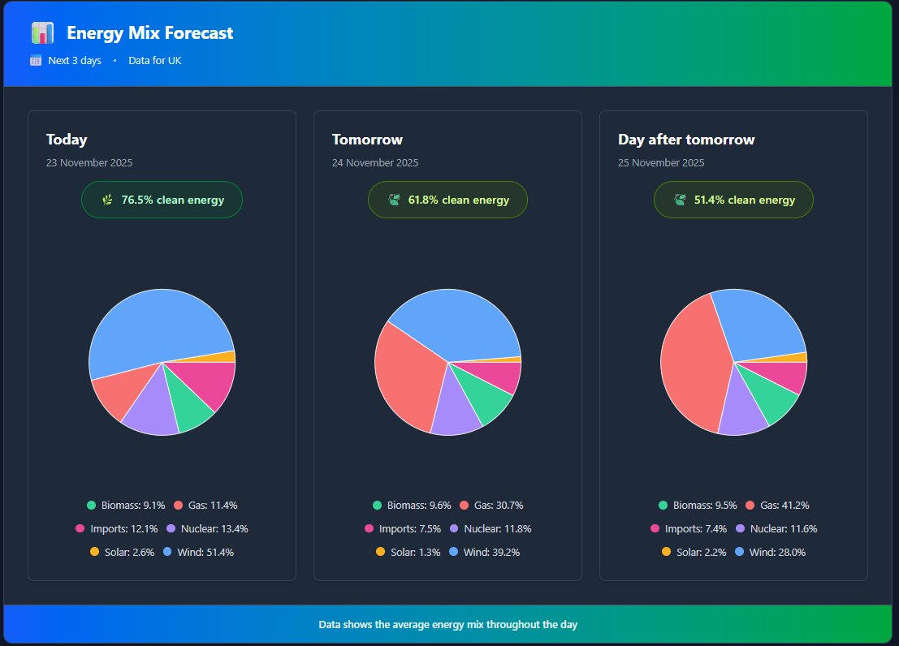
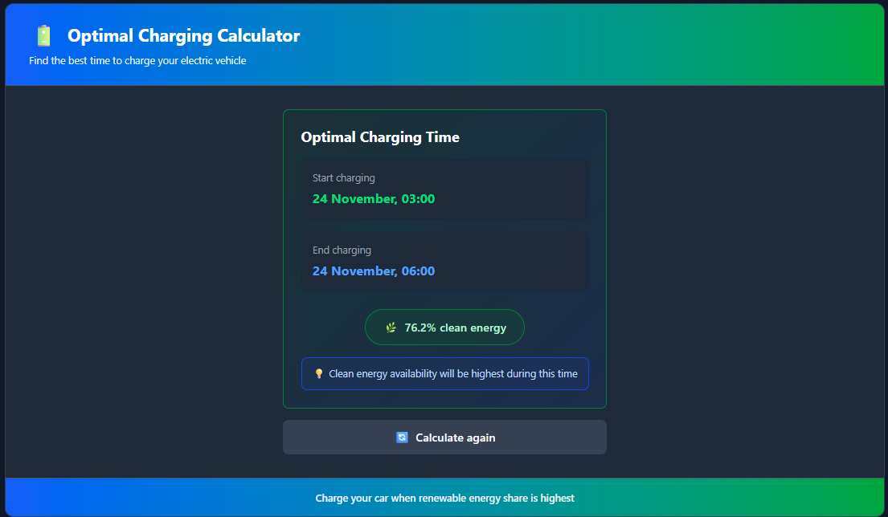

# Energy Frontend App

> Modern React dashboard for UK energy mix visualization and EV charging optimization

[](https://reactjs.org/)
[](https://www.typescriptlang.org/)
[](https://vitejs.dev/)
[](https://tailwindcss.com/)

---

## Features

**🔋 Energy Mix Visualization**
- 3-day UK energy forecast
- Clean energy percentage badges
- 

**⚡ Optimal Charging Calculator**
- Smart EV charging scheduler based on renewable energy availability
- Visual results with start time, end time, and clean energy %
- 

**♿ Accessibility**
- Font sizes: Small, Medium, Large (localStorage persistence)
- Light/Dark theme toggle
- 

---

## 🛠️ Tech Stack

**Core:** React 19, TypeScript 5.9, Vite 7.2, Tailwind CSS 4.1  
**Charts:** Recharts 3.4  
**Utils:** date-fns 4.1 (UK locale)  
**Testing:** Cypress 15.7

---

## 📁 Project Structure

```
src/
├── components/          # UI Components (feature-based)
│   ├── accessibility/  # Font & theme controls
│   ├── energyMix/      # Energy visualization
│   ├── optimalCharging/# Charging calculator
│   └── shared/         # Reusable components
├── hooks/              # Custom React hooks
│   ├── useEnergyMix.ts
│   ├── useOptimalCharging.ts
│   └── useAccessibility.ts
├── services/           # API communication
├── types/              # TypeScript interfaces
├── utils/              # Helper functions
└── config/             # Configuration
```

---

## 🔌 API Integration

**Backend Endpoints:**
```
GET /energy/mix
Response: [{ date, averageGenerationMix, cleanEnergyPercentage }]

GET /energy/optimal-charging?duration=3
Response: { startTime, endTime, averageCleanEnergyPercentage }
```